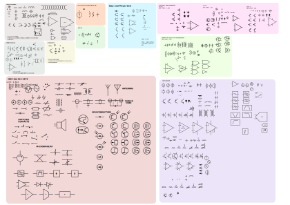
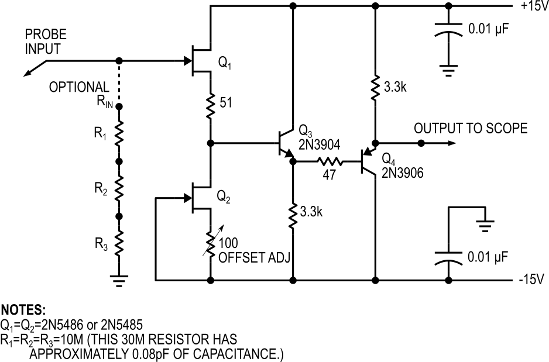
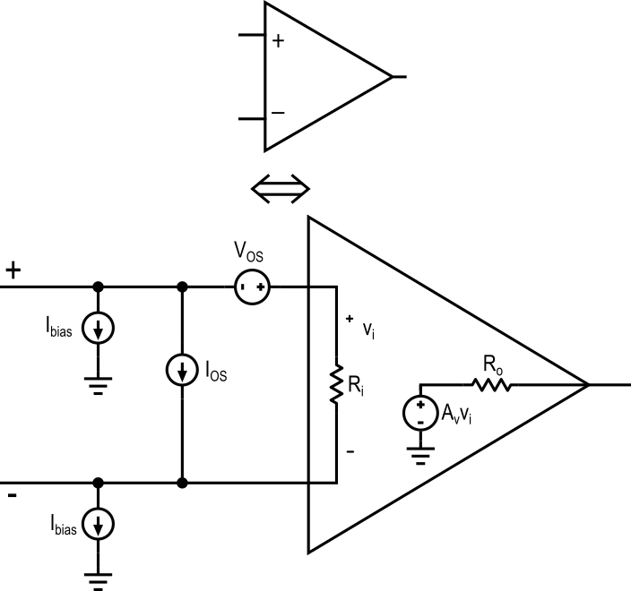
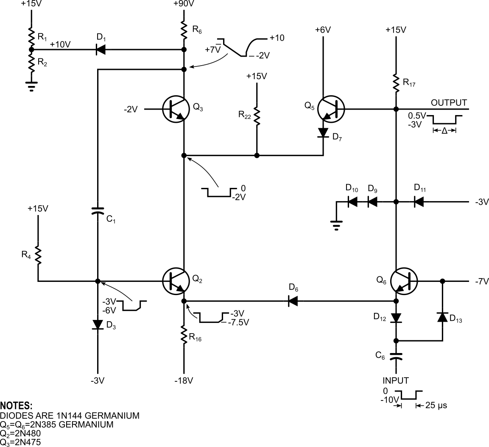
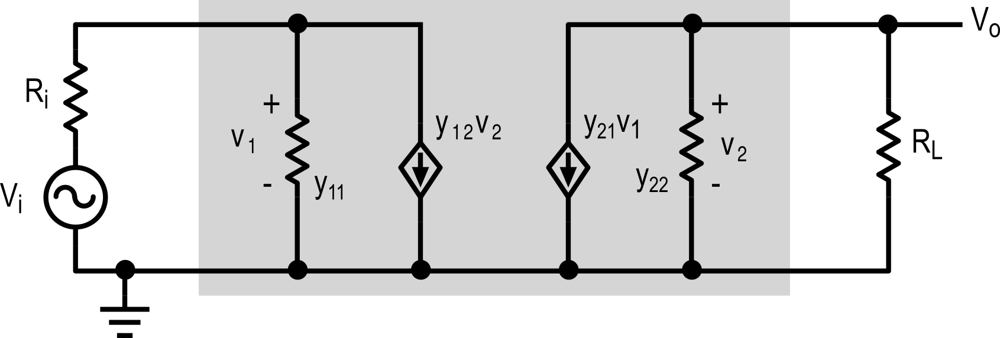
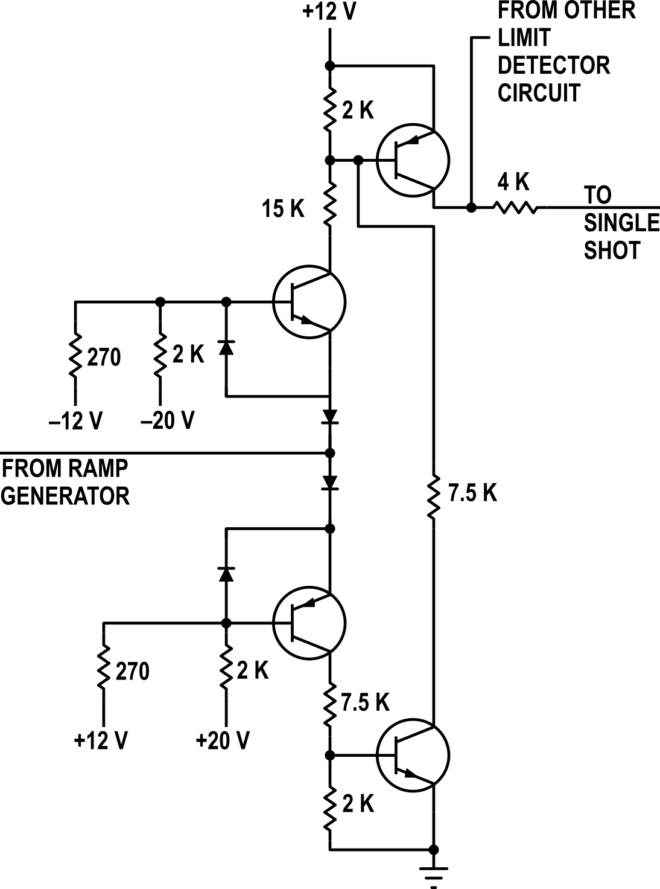
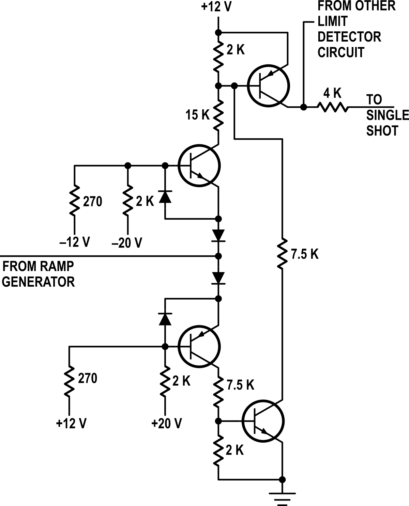

# SVG Schematic Symbols
Vector schematic symbols redrawn from Linear Tech, Nat Semi, Analog Devices, textbooks, standards, and more.

**Updates**:
- Inkscape attributes added for identifying components programmatically
- Circuit_macros svg symbols are being adapted from the website, see Circuit_macros.svg. These are copyright (c) 2026 J. D. Aplevich. The code for Circuit_macros is under the LaTeX Project Public License. 

### About This Project
The most common recommendations for creating high-quality schematics seem to be [CircuiTikZ](https://ctan.org/pkg/circuitikz?lang=en), [XCircuit](https://opencircuitdesign.com/xcircuit/), and [Circuit_macros](https://ece.uwaterloo.ca/~aplevich/Circuit_macros/html/examples.html), all of which have a steep learning curve and high effort-to-result ratios. Inkscape is not often recommended, and is only occasionally mentioned, which seems unjustified, because Inkscape is one of the most powerful vector graphics editing programs available, and it's free. 

Inkscape has all of the functionality required of a schematic editor. It is a WYSIWYG editor with an easy learning curve, and everything is readily editable, from line weights to colors to arrow shapes and grid sizes. You can use default or custom fonts, use extensions to insert LaTeX equations directly on your schematic, and embed raster or vector graphics, all with a drag-and-drop interface. You can export to png, svg, eps, and so on; raster graphics like png have easily configurable resolution. A high-quality schematic can be created as quickly as one could draw it on a piece of paper, and symbols can be tweaked and customized as much as you want. And of course, Inkscape is free and open source. It really is the best option for drawing schematics.

With this collection of symbols, you can quickly create publication-quality graphics using the same symbol palettes as your favorite manufacturers and textbooks. Symbols are drawn to a 1px grid (coarse grid used for all terminals) with 0.5, 0.7, 1.0, and 1.5px line widths depending on the style. Component sizing is standardized to the resistor. This scale is used for tracing (and often improving upon) other components. Deviations from the original symbols typically come from corrections to symmetry and better alignment to the standard grid. Missing symbols that are small variations from "attested" symbols were added in some cases.

### Symbol Library

Symbols were drawn in Inkscape and this is the easiest way to work with them. They're easy to modify and adjust to your own preferences. Fonts attempt to match the original style, while keeping things free and open source. 

Sources of symbols:
* Original drawings
* Application notes and datasheets:
  * Linear Technology
  * Analog Devices
  * Motorolla
  * National Semiconductor
* Textbooks:
  * Art of Electronics (3ed)
  * Gray and Meyer (5ed)
  * Clarke and Hess
* IEEE Std 315-1975

You'll find the symbols grouped by their source so that consistent style can be maintained. 

Similar projects and symbol collections:
* https://github.com/upb-lea/Inkscape_electric_Symbols
* https://en.m.wikipedia.org/wiki/File:Electrical_symbols_library.svg
* [Circuit_macros](https://ece.uwaterloo.ca/~aplevich/Circuit_macros/html/examples.html)
* https://www.mbeckler.org/inkscape/circuit_symbols/

## Symbols

## Fonts
On Windows, fonts are Arial, Arial Narrow (or Condensed), Cambria, Helvetica Narrow (non-free), or Adobe Caslon Pro (optional, for Greek symbols).
On Linux, use Liberation Sans, Liberation Sans Narrow, Free Sans, or Noto Sans Condensed. 

## Examples

**Example 1.** Active probe circuit from Bob Pease, _Troubleshooting Analog Circuits_. Linear Technology style.

**Example 2.** Op amp equivalent circuit. Linear Technology style.

**Example 3.** A "phantastron" pulse generator, from Markus' _Sourcebook of Electronic Circuits_. National Semiconductor style.

**Example 4.** Y-parameters two-port equivalent circuit. Linear Technology style.

**Example 5.** Limit detector, from Markus' _Sourcebook of Electronic Circuits_. In IEEE Std 315-1975 style, then in an adapted style more similar to the original.

**Example 6.** ADI AD534 schematic, from [MT-079: Analog Multipliers](https://www.analog.com/media/en/training-seminars/tutorials/MT-079.pdf). In Analog Devices style, .svg output.

**Example 7.** SCR-UJT time delay circuit, from Markus' _Sourcebook of Electronic Circuits_. 

## Inkscape Tips and Tricks
These are the most useful tips and tricks I've found when using Inkscape. I'm using verison 1.22.

**Page Setup.** It's often worth changing the page setup so that (a) the page background is white instead of transparent, (b) the units are correct, (c) the page size is reasonable. Using landscape A3 to A0 will give you a very large canvas. 

**Default Page.** To change the default settings when opening a new page, create a new file and adjust it how you want, then go to `File > Save Template...` and check the `Set as default template` box. 

**Units.** Personally I prefer using pixel (px) units. There are two settings to change: under `File > Document Properties` in the first tab, `Display`, change the Display units. Then go to the `Grids` tab and change the Grid units. Set the spacing to an integer value. 

**Exporting.** When your schematic is finished, export to PNG by going to `File > Export` and using the dialog. Export by selection, and check the "Export Selected Only" to avoid including any background stuff you didn't explicitly select, in case that's an issue. I usually default to 300 DPI, or 96 DPI if that's too large.

**Enable Snapping.** The Inkscape default snapping settings are a bit overzealous. I find it easiest to disable bounding box snapping, enable Object Midpoint snapping, disable Smooth Node snapping, and disable Alignment snapping. 

**Temporarily Disable Snapping.** Dragging something while holding `shift` (after starting the drag) disables snapping. 

**Selecting Things.** When things are grouped, `ctrl+click` will select something within the group without changing the editing context. If you're trying to select something and there's a background box or image so you can't drag-select, select one of the things, then `shift+click` and drag and it will perform a drag-select.

**Keyboard Shortcuts.** Learn the basic tool shortcuts. Wires are lines, so I changed the hotkey for the Pen tool to `l`. The ellipse tool is `e`, the rectangle tool is `r`. 

**Fill and Stroke.** Selecting an object and clicking on the color palette at the bottom will change its fill color. Holding shift and clicking will change its stroke color. Use transparent fill when you can, unless you have a triangle or similar closed shape with sharp corners. To set the default stroke, select something with the right style, enable the pen tool (`l` if you followed the previous tip), then click the `Stroke` color box in the upper right. Check `This tool's own style` under `Style of new objects`, and choose `Take from selection`. This adapts the pen tool to use the same fill and stroke as the selected object.

